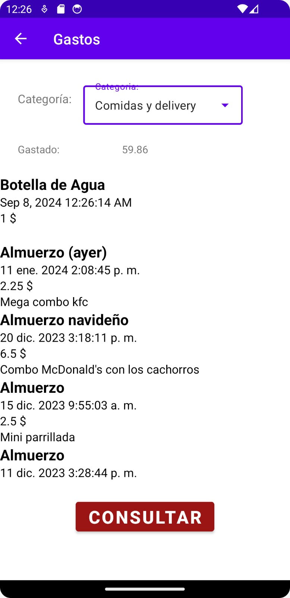

# MiMonedero
<!-- Aplicación móvil para la gestión de gastos personales. Organiza tus gastos en categorías y visualiza tu historial financiero de manera sencilla. -->


Esta es una aplicación personal desarrollada en **Java** que permite la gestión y control de gastos divididos en categorías. Utiliza una base de datos **SQL** para almacenar de manera eficiente todos los registros financieros. Este proyecto demuestra experiencia en el desarrollo de aplicaciones móviles, así como en operaciones CRUD (Create, Read, Update, Delete), el uso de bases de datos y de tecnologías backend y frontend.

## Tecnologías Utilizadas

- **Java**: Lenguaje de programación principal para el desarrollo de la app.
- **Base de Datos (SQL)**: Utiliza SQLite para la gestión y almacenamiento de datos.
- **Android Studio**: IDE utilizado para el desarrollo de la aplicación.
- **CRUD Operations**: Implementación completa de operaciones de creación, lectura, actualización y eliminación.

## Arquitectura
La aplicación sigue el patrón de diseño **MVVM (Model-View-ViewModel)** para una separación clara de responsabilidades.

## Características

- **Clasificación de Gastos**: Organiza tus gastos en categorías como alimentación, transporte, ocio, etc.
- **Base de Datos Local**: Almacenamiento seguro y eficiente de datos.
- **Interfaz de Usuario Intuitiva**: Diseño amigable para una experiencia fluida en dispositivos móviles.
- **Reportes de Gastos**: Visualiza y analiza tu historial de gastos de manera sencilla.

## Capturas de Pantalla

<table style="width: 100%; border-collapse: collapse;">
  <tr>
    <th style="width: 33%; text-align: center;">Pantalla Principal</th>
    <th style="width: 33%; text-align: center;">Formulario gastos</th>
    <th style="width: 33%; text-align: center;">Mostrar gasto</th>
  </tr>
  <tr>
    <td style="text-align: center; "></td>
    <td style="text-align: center;"></td>
    <td style="text-align: center;"></td>
  <tr>
    <td style="text-align: center;">La pantalla principal donde se muestran los gastos y se accede a otras funcionalidades.</td>
    <td style="text-align: center;">Interfaz para añadir nuevos gastos a la aplicación.</td>
    <td style="text-align: center;">Pantalla para mostrar los detalles de un gasto existente.</td>
  </tr>
</table>

<table style="width: 100%; border-collapse: collapse;">
  <tr>
    <th style="width: 33%; text-align: center;">Eliminar gasto</th>
    <th style="width: 33%; text-align: center;">Actualizar gasto</th>
    <th style="width: 33%; text-align: center;">Mostrar gastos</th>
  </tr>
  <tr>
    <td style="width: 33%; text-align: center;"></td>
    <td style="width: 33%; text-align: center;"></td>
    <td style="width: 33%; text-align: center;"></td>
  </tr>
  <tr>
    <td style="text-align: center;">Opción para eliminar un gasto registrado.</td>
    <td style="text-align: center;">Opción para actualizar los datos de un gasto existente.</td>
    <td style="text-align: center;">Vista de la lista completa de gastos según la categoría seleccionada.</td>
  </tr>
</table>


## Instalación y Ejecución

### Requisitos Previos
- Android Studio 4.0 o superior
- JDK 8 o superior
- Emulador de Android o dispositivo físico

### Pasos

1. **Clonar el repositorio**:
    ```bash
    git clone https://github.com/davidromeroy/MiMonedero.git
    ```

2. **Abrir en Android Studio**:
   - Abre Android Studio.
   - Selecciona "Open an existing project" y elige la carpeta `ahorros` que se encuentra en el proyecto clonado.

3. **Ejecutar la Aplicación**:
   - Conecta un dispositivo Android o utiliza un emulador.
   - Haz clic en el botón "Run" en Android Studio.

## Funcionalidades CRUD

- **Crear Gasto**: Añadir un nuevo gasto con detalles como categoría, monto, y fecha.
- **Leer Gastos**: Consultar y visualizar el historial de gastos registrados.
- **Actualizar Gasto**: Modificar detalles de un gasto existente.
- **Eliminar Gasto**: Borrar un gasto de la base de datos.

## Ejemplos de Uso para Funcionalidades CRUD

### Crear Gasto
Para añadir un nuevo gasto, navega a la pantalla de formulario de gastos y completa los detalles como categoría, monto, y fecha. Por ejemplo:
- **Categoría**: Alimentación
- **Item**: Saco de arroz
- **Monto**: 10.00
- **Fecha**: 2024-09-08
- **Detalles (opcional)**: Compra en supermercado

### Leer Gastos
En la pantalla principal, puedes consultar el historial de gastos registrados. Los gastos se muestran en una lista categorizada. Por ejemplo, si has añadido un gasto en la categoría de "Transporte", podrás ver todos los gastos en esta categoría.

### Actualizar Gasto
Para modificar un gasto existente, selecciona el gasto que deseas actualizar en la lista y edita los detalles. Por ejemplo, puedes cambiar el monto de un gasto de 20.00 a 22.50.

### Eliminar Gasto
Para eliminar un gasto, selecciona el gasto en la lista y elige la opción de eliminar. Esto borrará el gasto seleccionado de la base de datos.


<!-- ## Contribución
Si deseas contribuir a este proyecto:

1. Realiza un fork del repositorio.
2. Crea una nueva rama (git checkout -b nueva-funcion).
3. Realiza tus cambios y haz commit (git commit -m 'Añadir nueva función').
4. Envía un Pull Request. -->

## Licencia
Este proyecto está bajo la licencia [MIT](./LICENSE).

## Contacto
Creado por [David Romero Yánez](https://github.com/davidromeroy). 
No dudes en contactarme si tienes alguna pregunta o sugerencia.
